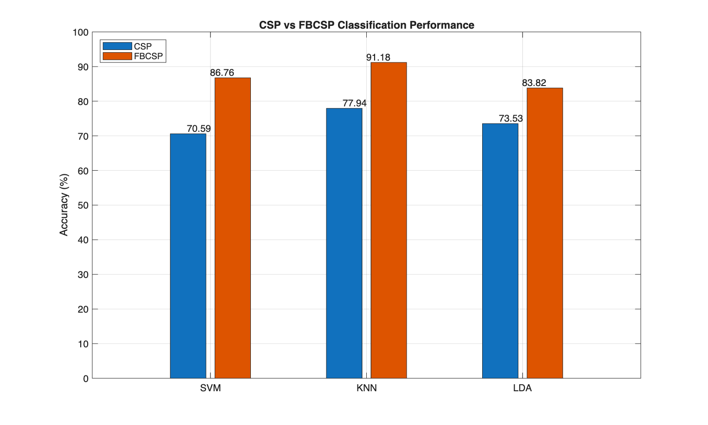

# EEG Motor Imagery Classification using FBCSP (MATLAB)

This project implements a full Brain-Computer Interface (BCI) pipeline to classify motor imagery EEG signals (Right Hand vs Foot). The objective is to transform raw EEG signals into discriminative features and evaluate multiple classifiers.

This repository is an extension of my previous EEG motor imagery classification project, which you can check out [here](https://github.com/SanazRezvani/eeg-motor-imagery-csp). In the original project, I implemented an EEG-based motor imagery classification pipeline using Common Spatial Patterns (CSP). In this extension, I improve the feature extraction stage by adding a **Filter Bank Common Spatial Pattern (FBCSP)** approach across the mu and beta rhythms.

This work is based on **BCI Competition III – Dataset IVa**. Read the [Dataset description](https://www.bbci.de/competition/iii/desc_IVa.html)

## Why FBCSP?

Motor imagery EEG activity is distributed across multiple frequency ranges, primarily within the mu (8–13 Hz) and beta (13–30 Hz) bands and the most informative frequency sub-bands can vary between subjects. Applying CSP on a single broad band may overlook frequency-specific patterns 

Filter Bank CSP (FBCSP) addresses this by:
- Decomposing EEG signals into multiple sub-bands
- Extracting spatial features from each sub-band
- Capturing complementary information across frequencies

This leads to a richer feature representation and can improve classification performance, especially in subject-specific decoding scenarios.

## Key Features

- Extension of a baseline CSP-based motor imagery decoding pipeline
- Filter bank decomposition across mu and beta rhythms (8–30 Hz)
- 10 overlapping sub-bands (4 Hz width, 2 Hz overlap)
- CSP feature extraction from each sub-band
- Concatenation of sub-band features
- Classification of motor imagery tasks using machine learning

## Design Choices

- **Sub-band design:** 4 Hz bandwidth with 2 Hz overlap to balance frequency resolution and redundancy  
- **Number of CSP pairs:** 1 pair per sub-band (2 features) to control dimensionality  
- **Classifier selection:** Compared SVM, KNN, and LDA for robustness  
- **Feature representation:** Variance of CSP-projected signals, a standard and interpretable choice for motor imagery BCI  

These design decisions aim to balance performance, interpretability, and computational efficiency.

---

## Pipeline Overview

### 1. Load EEG motor imagery data

- Download the dataset from [BCI Competition III – Dataset IVa](https://www.bbci.de/competition/iii/)

- Open MATLAB

- Start by loading one of the subjects. ` data_set_IVa_al.mat ` is chosen here.

- Run: ` run_pipeline.m `

Inside `run_pipeline.m`, you can modify:
``` 
config.dataset_path = 'data_set_IVa_al.mat';
config.spatial_filter = 'CAR';       % options: 'CAR', 'Low Laplacian', 'High Laplacian'
config.filter_order = 3;
config.train_ratio = 0.70;
config.num_csp_pairs = 1;
config.trial_length_s = 3.5;
config.plot_figures = true;
config.visualise_csp = false;
```
### 2. Apply filter bank decomposition across 8–30 Hz  

EEG signals are decomposed into overlapping sub-bands across the mu and beta rhythms (8–30 Hz), where motor imagery-related activity is known to occur. This filter bank approach allows the model to capture subject-specific discriminative patterns that may not be visible in a single broad frequency band.

```
Sub-bands used:
8–12, 10–14, 12–16, ..., 26–30 Hz
```

### 3. Apply Spatial filtering to each sub-band

Implemented spatial filters:

- [`apply_spatial_filter.m`](apply_spatial_filter.m) (main interface)  
- [`car_filter.m`](car_filter.m) (CAR)  
- [`laplacian_low.m`](laplacian_low.m) (Low Laplacian)  
- [`laplacian_high.m`](laplacian_high.m) (High Laplacian)  

These filters enhance spatial resolution and reduce noise.


### 4. Extract CSP features from each sub-band

Implemented in: 
[`compute_csp_filters.m`](compute_csp_filters.m) (compute_csp_filters) 

For each frequency sub-band, Common Spatial Pattern (CSP) is applied to extract discriminative spatial features between the two motor imagery classes.

CSP computes spatial filters that maximise variance for one class while minimising it for the other. This results in projections that emphasise class-specific neural activity.
```
features_band(:, trial_idx) = var(projected_trial, 0, 2);
```

In this implementation:

CSP is computed independently for each sub-band
A fixed number of CSP filter pairs are selected per band
Each trial is projected onto the CSP filters
The variance of the projected signals is used as the feature representation

This allows the model to capture frequency-specific spatial patterns, which are critical in motor imagery EEG analysis.


### 5. Concatenate features across sub-bands

The CSP features extracted from each sub-band are concatenated to form a single feature vector for each trial.

Since each sub-band captures complementary information from different parts of the mu and beta frequency ranges, combining them provides a richer representation of the underlying neural activity.

In this project:

Each sub-band contributes a set of CSP features
Features from all sub-bands are stacked vertically
The final feature vector includes information from all frequency bands
```
all_features = [features_band1;
                features_band2;
                ...
                features_bandN];
```
In this implementation:
```
10 sub-bands × 2 CSP features = 20 features per trial
```

### 6. Train and evaluate classifiers

Three classifiers are implemented:

- Support Vector Machine (SVM)
- K-Nearest Neighbors (KNN)
- Linear Discriminant Analysis (LDA)

## Results

The FBCSP extension extracted CSP features from 10 overlapping sub-bands between 8–30 Hz. With one CSP pair per sub-band, this produced 20 features per trial.

| Classifier | Accuracy |
|---|---:|
| SVM | 86.76% |
| KNN | 91.18% |
| LDA | 83.82% |

### CSP vs FBCSP Comparison

The figure compares the classification performance of the [baseline CSP pipeline](https://github.com/SanazRezvani/eeg-motor-imagery-csp) and the extended FBCSP approach across three classifiers: SVM, KNN, and LDA.



## Key Takeaways

- FBCSP increases feature dimensionality from 2 to 20 features per trial  
- FBCSP captures frequency-specific spatial patterns in EEG signals  
- FBCSP provides a more expressive representation than single-band CSP
- FBCSP outperforms CSP across all three classifiers
- The highest accuracy is achieved using KNN with FBCSP (91.18%)
- FBCSP improves performance by extracting CSP features from multiple overlapping sub-bands across the mu and beta rhythms

This highlights the importance of combining spatial and spectral information in EEG decoding.


## Next Extension

This project is still an offline motor imagery decoding pipeline. However, it provides a stronger feature extraction foundation for a future real-time EEG decoding simulation using sliding windows and latency-aware inference.

The next extension is:

[Real-time EEG decoding simulation using sliding windows.](https://github.com/SanazRezvani/real-time-bci)
